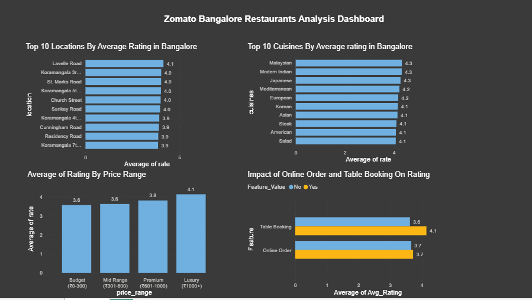

# 🍽️ Why Do Some Restaurants Fail on Zomato Bangalore?
### A Data Analysis Project | Python | Pandas | Seaborn | Matplotlib

## 📌 Project Overview
While Zomato offers equal visibility to all listed restaurants in
Bangalore, some consistently receive high ratings and customer
engagement while others struggle to survive.

This project analyzes 41,263 restaurants from the Zomato Bangalore
dataset to identify what factors — location, cuisine, price range,
and service features — differentiate successful restaurants from
failing ones.

## ❓ Business Questions Answered
1. Which cuisines and localities have the highest average ratings?
2. Does price range affect customer ratings?
3. Do online ordering and table booking impact restaurant success?

## 📊 Key Findings

| Factor | Finding |
|---|---|
| 🏙️ Location | Lavelle Road (4.14) and Koramangala lead Bangalore |
| 🍜 Cuisine | Malaysian, Modern Indian and Japanese rate highest |
| 💰 Price | Luxury restaurants (₹1000+) rate 0.56 higher than budget |
| 📱 Online Order | Minimal impact — only +0.06 rating difference |
| 📅 Table Booking | Strongest factor — +0.52 rating difference |

## 📊 Power BI Dashboard
An interactive dashboard was built in Power BI covering:
- Top 10 Locations by Average Rating
- Top 10 Cuisines by Average Rating
- Average Rating by Price Range
- Impact of Online Order & Table Booking on Rating

## 🛠️ Tools & Technologies
- **Python 3**
- **Pandas** — data cleaning and manipulation
- **Matplotlib & Seaborn** — data visualization
- **Jupyter Notebook** — analysis environment

## 📁 Project Structure
Zomato-Bangalore-Analysis/
│
├── Zomato_Bangalore_Analysis.ipynb    # Main analysis notebook
├── Zomato-Bangalore-Dashboard.pbix   # Power BI dashboard
├── zomato_cleaned.csv                # Cleaned dataset
├── zomato_cuisines.csv               # Exploded cuisines data
├── zomato_features.csv               # Service features data
├── Dashboard_Screenshot.png          # Dashboard preview
└── README.md                         # Project documentation

## 💡 Business Recommendation
A new restaurant maximises success on Zomato Bangalore by:
- Opening in **Koramangala or Lavelle Road**
- Offering **international or fusion cuisine**
- Pricing in the **₹400-800 range** for two people
- Enabling **table booking** for premium experience

## 📂 Dataset
- **Source:** [Zomato Bangalore Restaurants — Kaggle](https://www.kaggle.com/datasets/himanshupoddar/zomato-bangalore-restaurants)
- **Size:** 51,717 rows × 17 columns (raw)
- **After cleaning:** 41,263 rows × 11 columns
- **Note:** Download `zomato.csv` from Kaggle and place it 
  in the same folder as the notebook before running.

## 👩‍💻 About Me
**Likhitha R** — Aspiring Data Analyst
- 🔗 [LinkedIn](https://linkedin.com/in/likhithar)
- 💻 [GitHub](https://github.com/LikhithaR-1996)

